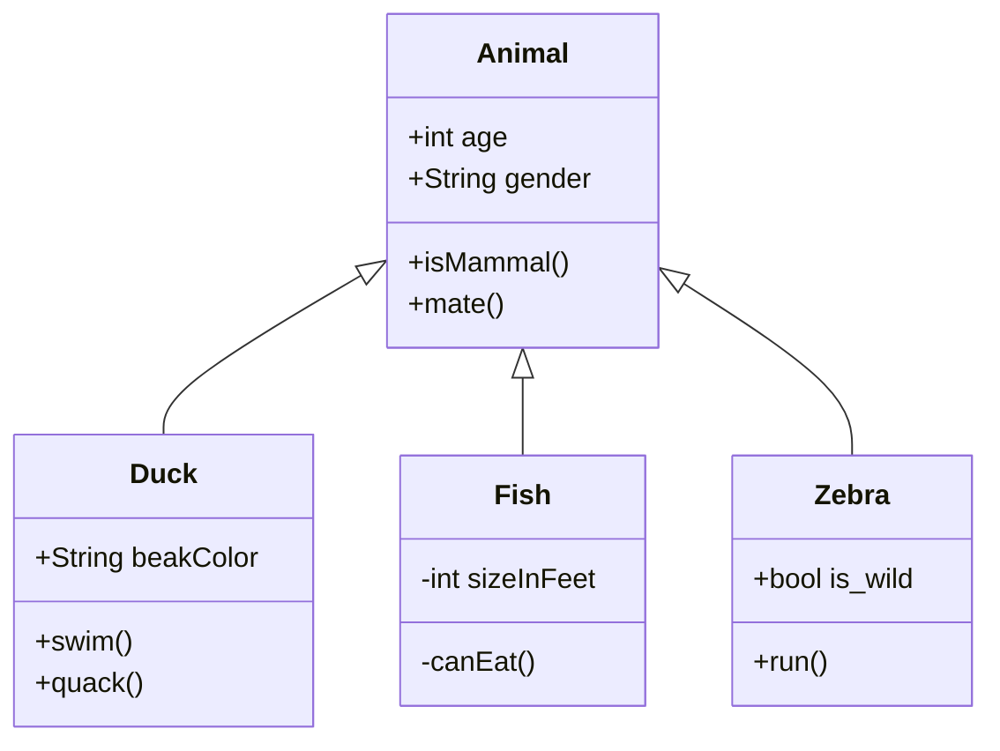

# Kotlin

<!-- TOC -->
* [Kotlin](#kotlin)
    * [Kotlin Compiler Options](#kotlin-compiler-options)
    * [Native Image](#native-image)
    * [Videos](#videos)
    * [Samples](#samples)
    * [Misc](#misc)
        * [Math](#math)
    * [OpenAPI Doc](#openapi-doc)
<!-- TOC -->

<tldr>
 <p>
   Shortcut: <shortcut>CMD + SPACE</shortcut>
</p>
 <p>
  Configure: <ui-path>Settings | View | Edit</ui-path>
</p>
</tldr>

### Kotlin Compiler Options

  ```bash
  $ kotlinc -X 2>&1 | grep -i release
  ```

### Native Image

```bash
$ sdk u java graalvm-ce-dev
$ cat > App.kt << EOF
fun main() {
  println("Hello Kotlin!")
}
EOF

# $ kotlinc -version \
#           -verbose \
#           -include-runtime \
#           -java-parameters \
#           -jvm-target 19 \
#           -Xjdk-release=19 \
#           -api-version 1.9 \
#           -language-version 2.0 \
#           -Werror \
#           -progressive \
#           App.kt -d app.jar

$ kotlinc -version -include-runtime App.kt -d app.jar
$ java -showversion -jar app.jar
$ native-image \
      --no-fallback \
      --native-image-info \
      --enable-preview \
      -jar app.jar

$ chmod +x app
$ time ./app

# Static image info
$ file app
$ otool -L app
$ objdump -section-headers  app

# Find GraalVM used to generate the image
$ strings -a app | grep -i com.oracle.svm.core.VM
```

### Videos

* https://www.youtube.com/watch?v=SEKsvHYZz8s (crypto 101)

### Samples

```kotlin
```

{src="kotlin/App.kt" lang="kotlin" validate="true" }

Download <res resource-id="movie-data" id="movie-data" instance="openjdk-playground"/>

### Misc



##### Math

```tex
\begin{equation}
 x = \frac{-b \pm \sqrt{b^2 - 4ac}}{2a}
\end{equation}
```

### OpenAPI Doc

<api-doc openapi-path="../resources/documentation.yaml"/>
